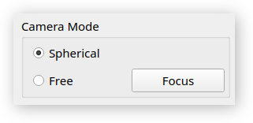

# User Manual

LayerView is a G-code file visualizer and inspector.
It supports the [RepRap](https://reprap.org/wiki/G-code) flavour and its derivatives.

---

## User Interface

### Load G-code file

G-code files can be loaded in several ways:

- Menu bar at the top of the window (File &#8594; Open).

  

- Keyboard shortcut `Ctrl+O`.
- Drop a G-code file onto the application's window.

  

### Clear scene

The visualization scene can be cleared via:

- Menu bar at the top of the window (File &#8594; Clear).

  

- Keyboard shortcut `Ctrl+Del`.
- Keyboard

---

### Camera Mode

The viewport can be moved around via one of the provided camera modes:

- ***Spherical*** - The camera orbits around a fixed focal point. Drag around the scene with the left mouse button
  pressed to orbit around the focal point. Zoom in and out with the scroll wheel.

    - To orbit, drag the mouse with the left mouse button pressed.
    - Use the keyboard to move the focal point (see *Mode-independent camera controls*).

- ***Free*** - The camera can be rotated around its own position and moved in any direction.

    - To look around, drag the mouse with the left mouse button pressed.
    - Zoom in/out with the scroll wheel.
    - Use the keyboard to move around (see *Mode-independent camera controls*).

#### Mode-independent camera controls

- Zoom in/out with the scroll wheel.
- Use the keyboard to move around:
    - ***W*** - Forward
    - ***A*** - Left
    - ***S*** - Backward
    - ***D*** - Right
    - ***Space*** - Up
    - ***Shift+Space*** - Down
- Focus on the model:
    - Press the ***Focus*** button in the ***Camera Mode*** control group.
    - Use the keyboard shortcut `Shift+F`.

---

### Coloring mode

Model layers can be colored, based on printing parameters. Available modes:

- ***Default*** - no coloring parametrization is applied. All layers have the same, default color.
- ***Feedrate*** - coloring is based on the average layer feedrate.
- ***Thickness*** - coloring is based on the layer thickness (height).
- ***Temperature*** - coloring is based on the nozzle temperature (currently only one extruder is supported).

If no G-code file is loaded, this control group has no effect. However, setting a specific coloring mode will persist
across G-code loading and clearing operations.

---

### Visible Layers

Visible layer range can be modified via the ***Visible Layers*** control group. This enables the user to inspect
intermediate model layers.

---

### Model Info

The ***Model Info*** tab provides the following information:

- ***Layer count*** - total number of layers in model.
- Model size, defined by the smallest possible bounding box enclosing the model (including any potential priming moves).
    - ***Height*** - Z axis (mm). - ***Width*** - X axis (mm). - ***Depth*** - Y axis (mm).

---

### Layer Info

The ***Layer Info*** tab provides information about a specific, selected layer:

- ***Z Position*** - Z axis value at which the layer is printed (mm).
- ***Thickness*** - layer thickness (mm).
- ***Temperature*** - nozzle temperature range (&deg;C).
- ***Feedrate*** - Effector translation speed range (mm/min).

---

## Visualization Scene

### Build area

The build area contains the visualized model. Its default and minimum size is 200x200x200 mm, however when the model
exceeds 90% of this volume, the build area is automatically scaled up in the necessary dimensions.

### Axes

The coordinate system's axes correspond to the G-code 3D space XYZ axes. In the visualization, they are color labeled as
follows:

- X - red,
- Y - green,
- Z - blue.

